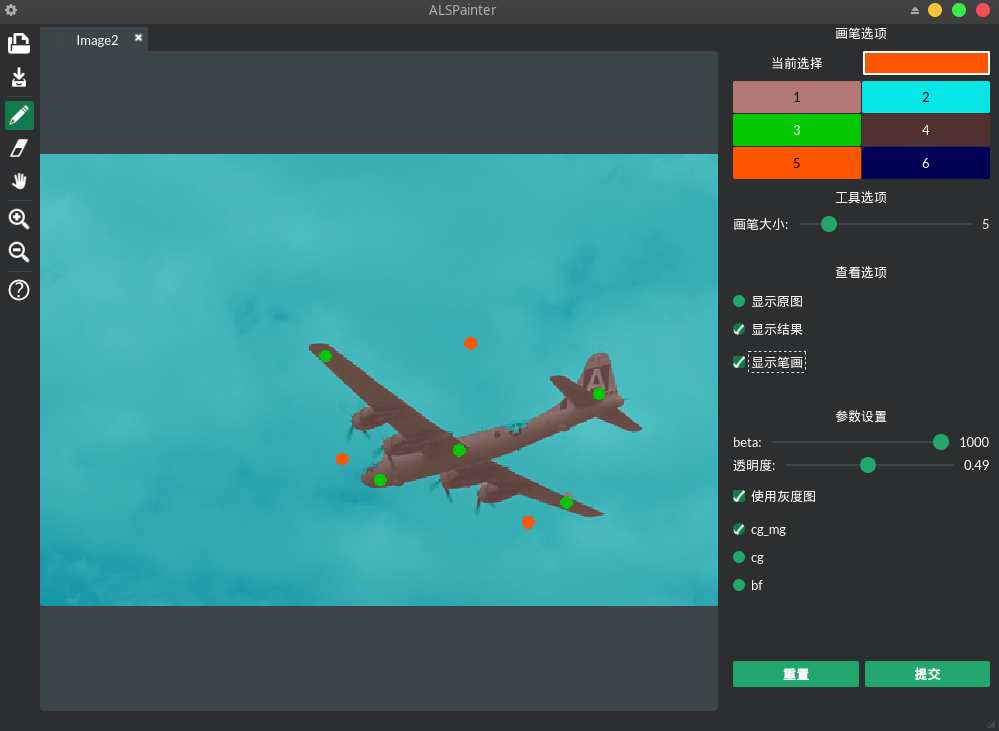

ALSPainter for segementation using random walk
====

**ALSPainter** is a multiplatform graphics editor inspired by [GANPaint](http://gandissect.res.ibm.com/ganpaint.html) ans is developed in Python and PyQt.

